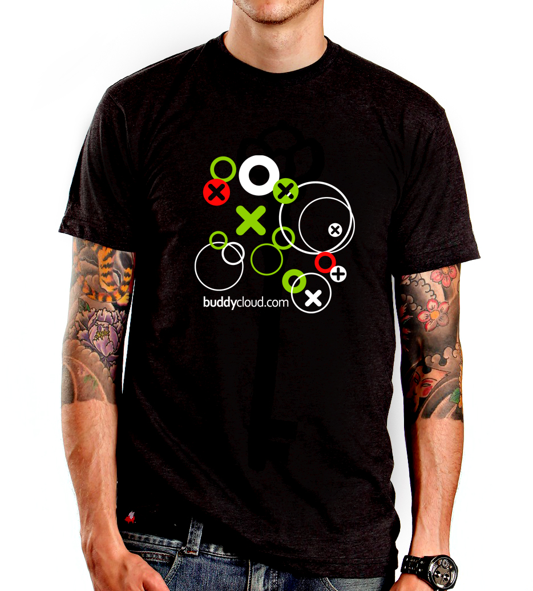

The Buddycloud project aims to build a rich user and group messaging ecosystem that can easily be embedded in any app,
and relies on an open protocol (based on [XMPP][]) and open-source software.

I contributed to the Buddycloud project from 2012 to 2013 as a volunteer.

<!--more-->

The Buddycloud protocol is built on top of several technologies:

- **[XMPP][]** ("Jabber") is used to connect clients to servers and servers to other servers;
- XMPP extensions [PubSub][] (XEP-0060) and [MAM][] (Message Archive Management, XEP-0313) are used to provide realtime
  notifications and data synchronization between clients and federated servers;
- The messages and events are **[Atom][]** entried, grouped in **[Activity Streams][]**;
- The initial [Buddycloud server][] was written in **[CoffeeScript][]**, and the initial web client in plain JavaScript
  with [Backbone.js][] (it *was* 2012 after all!);
- Later versions of the server and client are written in Java and AngularJS.

Now some highlights about things I did on my own:

- Added support for **content deletion that worked well across federated servers** using [Atom Tombstones][]: my first
  contributions to the Buddycloud protocol and server!
- Integrated [Embedly][] for rich link previews in the initial web client.
- Took over the [initial server component][Buddycloud server] development and improved it *a lot*:
    * improved packaging for major Linux distributions;
    * added *lots* of unit tests;
    * fixed *lots* of bugs;
    * improved the DB schema to make use of **[PostgreSQL][] XML support**, making the whole server safer *and* faster
      at the same time.
- Wrote a test suite that ran a real XMPP server + 3 Buddycloud instances to provide realistic test scenarios.
- Wrote a whole [console client][bccc] (in **[Python][]**) that did not rely on the HTTP APIs but only on native XMPP
  connections.

---

Buddycloud was a lot of fun for me. I like its approach of designing the protocol *before* implementing it a lot, as
opposed to "defined by implementation" protocols which often later prove hard to re-implement for interoperability
purposes. I learned a lot while working on Buddycloud, and I'm very grateful to Simon Tennant for his help and his
support.

I worked on Buddycloud on my free time as a volunteer, and I only stopped because I had not enough free time left after
I joined [Findspire]().

Fun fact: I won a Buddycloud T-shirt at [FOSDEM][] in 2012! The challenge was to setup a working Buddycloud instance and
get in touch with the team… Had a really nice time with them at the XMPP "realtime booth". I still proudly wear that
T-shirt from time to time :wink:

[Activity Streams]: http://activitystrea.ms/
[Atom Tombstones]: https://tools.ietf.org/html/rfc6721
[Atom]: https://tools.ietf.org/html/rfc4287
[Backbone.js]: http://backbonejs.org/
[Buddycloud server]: https://github.com/buddycloud/deprecated-buddycloud-server
[CoffeeScript]: https://coffeescript.org/
[Embedly]: https://embed.ly/
[FOSDEM]: https://fosdem.org/
[MAM]: https://xmpp.org/extensions/xep-0313.html
[PostgreSQL]: https://www.postgresql.org/
[PubSub]: https://xmpp.org/extensions/xep-0060.html
[Python]: https://www.python.org/
[XMPP]: https://xmpp.org/
[bccc]: https://github.com/Schnouki/bccc
