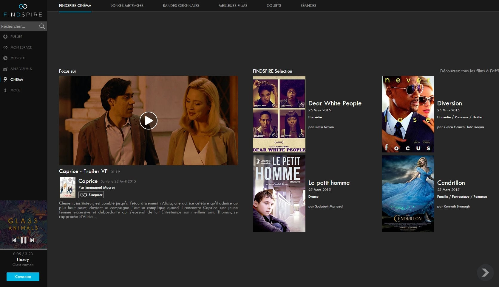
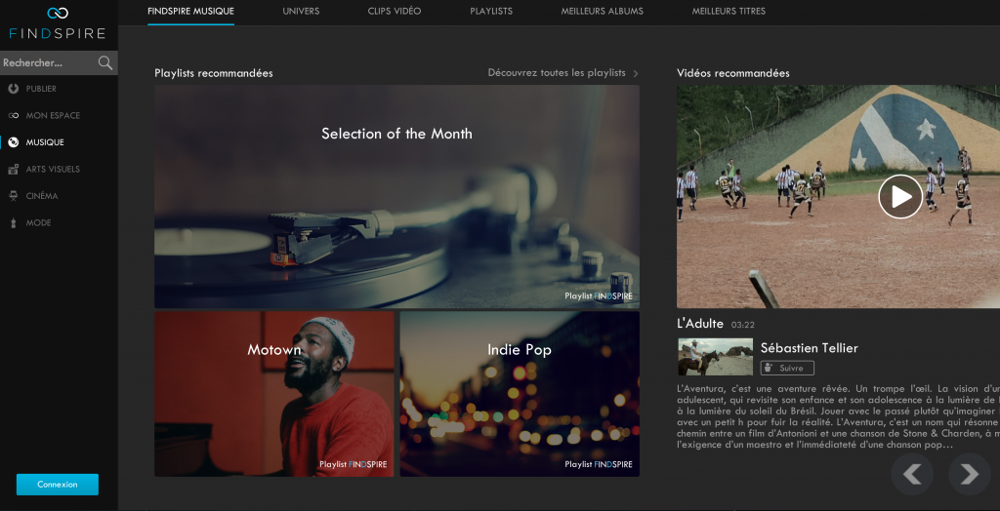
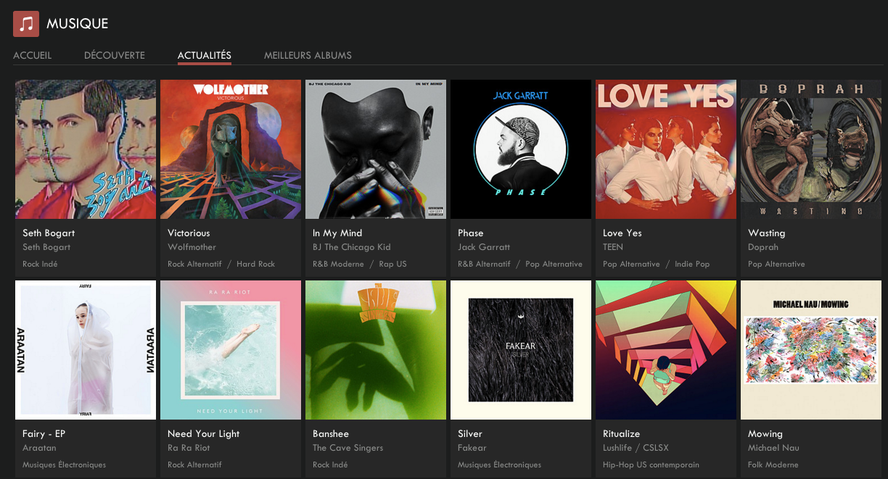

Findspire is a artistic content discovery platform. Its main service is a music and video streaming service, quite
similar to Spotify or Deezer.

I worked at Findspire as lead software engineer from 2013 to 2016.

<!--more-->

In 2016, it had more than **7 million audio tracks**, several hundred thousands images and tens of thousands of music
videos.

I was actually the first hire of the team, working directly with the 2 co-founders (CEO and CTO). As lead software
engineer, I was responsible for a lot of things, including:

- architecture and development of the **web back-end** using **[Django][]**, including a custom ORM for several NoSQL databases ([CouchDB][], [Redis][] and [Elasticsearch][]);

- development of the first versions of the **web front-end**, first in vanilla JavaScript, then with **[Backbone][]** (which
  made sense in 2013);

- development of a **media processing pipeline** using **[Celery][]**, [ImageMagick][] and [ffmpeg][] (audio and video
  transcoding, image processing and resizing, storage…);

- tooling required for deploying the site: various Shell scripts around Django and `r.js`;

- **system administration** ("devops") of the hosting platform: various Linux hosts with 2 FreeBSD load balancers, managed
  with [Puppet][] and [Foreman][];

- development of the first versions of the **Android app**;

- development of a content ingestion system to integrate the catalogue of major music distributors (Universal Music,
  Warner Music, Sony Music Entertainment, EMI, Believe, Because, PIAS, etc.) in the website: **data storage**, **audio
  processing** (which entailed **adding DRM** to audio files), **metadata handling** with *lots* of overly complex,
  poorly formatted XML files ([DDEX][] and ITMSP standards);

- development of a **content distribution system** to let end-users access this music, with **advanced authentication
  and authorization** based on the user's location, the date, their premium status, and rights described in the
  distributor's metadata;

- development of several **Flash media players** to access the content: a headless audio player controlled from
  JavaScript, and a video player that could be embedded in Facebook and Twitter posts.

That's a lot of things in only 3 years!

Findspire closed down in October 2016.

[Backbone]: http://backbonejs.org/
[Celery]: http://www.celeryproject.org/
[CouchDB]: https://couchdb.apache.org/
[DDEX]: http://ddex.net/
[Django]: https://www.djangoproject.com/
[Elasticsearch]: https://www.elastic.co/products/elasticsearch
[ffmpeg]: https://ffmpeg.org/
[Foreman]: https://www.theforeman.org/
[ImageMagick]: https://www.imagemagick.org/
[Puppet]: https://puppet.com/
[Redis]: https://redis.io/
