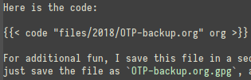
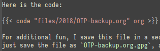

I'm working on some new content for this blog that uses a lot of [shortcodes][]. The problem is that in Emacs,
[markdown-mode][] doesn't know about shortcodes, so it doesn't render them properly:

Fortunately, a few lines of Emacs Lisp and it works beautifully:



Sure, it's not much. But I like it!

(This requires your Hugo site to be a [Projectile][] project, but since just having it in a git repository is enough,
that should not be a problem…)

[markdown-mode]: https://github.com/jrblevin/markdown-mode/
[Projectile]: https://github.com/bbatsov/projectile/
[shortcodes]: https://gohugo.io/content-management/shortcodes/
