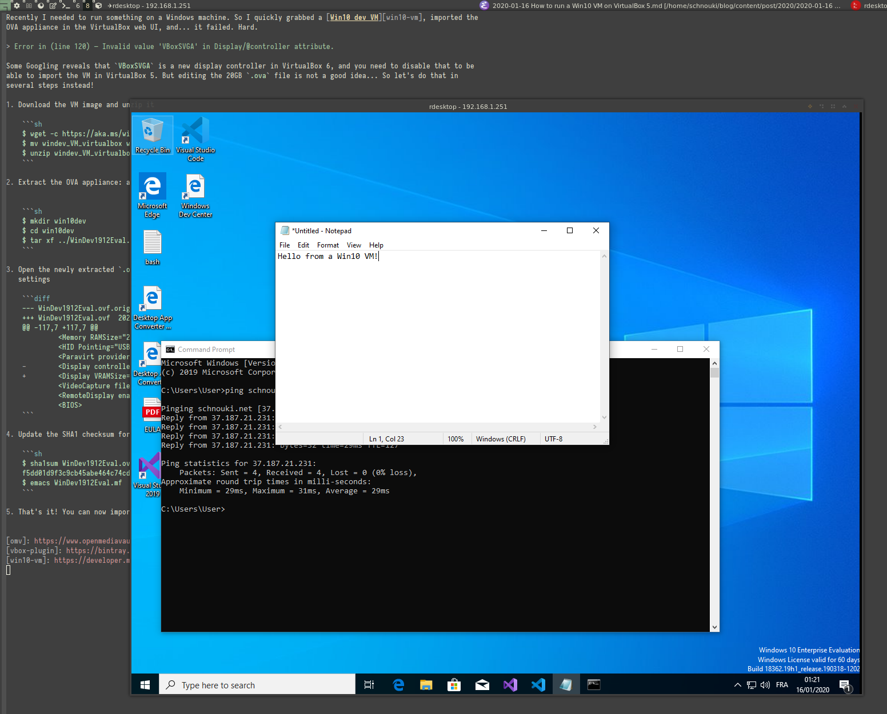

I have a NAS (HP ProLiant Gen10 microserver) running [OpenMediaVault 4][omv] with the [VirtualBox
"plugin"][vbox-plugin]. Meaning it runs VirtualBox 5.2, while the latest version is 6.1.

Recently I needed to run something on a Windows machine. So I quickly grabbed a [Win10 dev VM][win10-vm], imported the
OVA appliance in the VirtualBox web UI, and... it failed. Hard.

> Error in (line 120) — Invalid value 'VBoxSVGA' in Display/@controller attribute.

Some Googling reveals that `VBoxSVGA` is a new display controller in VirtualBox 6, and you need to disable that to be
able to import the VM in VirtualBox 5. But directly editing the 20GB `.ova` file is not a good idea... So let's do that
the right way!

1. Download the VM image and unzip it

    ```sh
    $ wget -c https://aka.ms/windev_VM_virtualbox
    $ mv windev_VM_virtualbox windev_VM_virtualbox.zip
    $ unzip windev_VM_virtualbox.zip
    ```

2. Extract the OVA appliance: a `.ova` file is actually a tar archive!


    ```sh
    $ mkdir win10dev
    $ cd win10dev
    $ tar xf ../WinDev1912Eval.ova
    ```

3. Open the newly extracted `.ovf` file with your favorite editor and remove `controller="VBoxSVGA"` from the Display
   settings

    ```diff
    --- WinDev1912Eval.ovf.orig	2020-01-16 00:36:04.744044319 +0100
    +++ WinDev1912Eval.ovf	2020-01-16 00:36:19.264207009 +0100
    @@ -117,7 +117,7 @@
             <Memory RAMSize="2048"/>
             <HID Pointing="USBTablet"/>
             <Paravirt provider="Default"/>
    -        <Display controller="VBoxSVGA" VRAMSize="128"/>
    +        <Display VRAMSize="128"/>
             <VideoCapture file="." fps="25"/>
             <RemoteDisplay enabled="false"/>
             <BIOS>
    ```

4. Update the SHA1 checksum for the `.ovf` file in the `.mf` manifest

    ```sh
    $ sha1sum WinDev1912Eval.ovf
    f5dd01d9f3c9cb45abe464c74cdbbd4eec4e85c3  WinDev1912Eval.ovf
    $ emacs WinDev1912Eval.mf
    ```

5. That's it! You can now import the OVF appliance in VirtualBox.




[win10-vm]: https://developer.microsoft.com/en-us/windows/downloads/virtual-machines
[vbox-plugin]: https://bintray.com/openmediavault-plugin-developers/arrakis/openmediavault-virtualbox#
[omv]: https://www.openmediavault.org/
